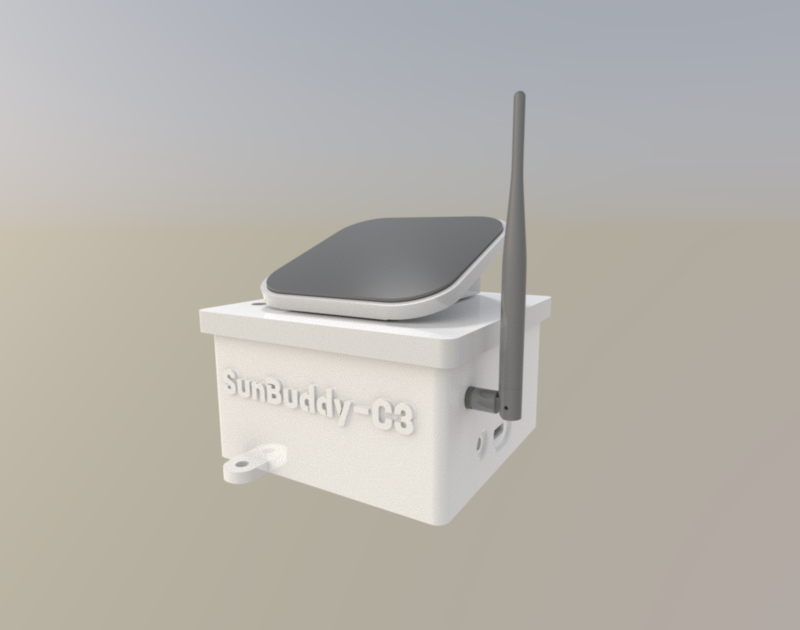

# 3D-Printed Case for SunBuddy-C3 Module

This repository contains design files for a 3D-printed case developed for the [SunBuddy-C3 Module](https://oshwlab.com/rrguardo83/water-level-.pro-s1-v2). The case is designed and tested for outdoor use, providing robust protection against rain and adverse weather conditions.

## Features

- **Weather Resistance:**  
  Engineered to withstand rain and prolonged exposure to outdoor environments.

- **Available Modifications:**  
  - **With Solar Panel Support:** Version adapted to incorporate a solar panel, ideal for projects requiring energy autonomy.  
  - **Without Solar Panel:** Simplified version for those not needing solar energy integration.

- **Customization and Modifications:**  
  The FreeCAD file is included, allowing users to make modifications and adaptations as needed.  
  **FreeCAD File License:** GPLv3.

- **Integrated Module:**  
  The design utilizes the **SunBuddy-C3 Module**.

## Repository Contents

- **STL Files:** For 3D printing the case.
- **FreeCAD File (.fcstd):** Enables editing and customization of the design.  
  *License: GPLv3.*
- **Documentation and Instructions:** Step-by-step guide for assembly and modifications.
- **Additional Resources:** Related models and schematics for the project.

[3D printable case files](3dcase)

For more details about important 3d printing recommendations 
 [read this tips](3dcase/3DPrintReadme.md).

## Usage Instructions

1. **Download and Print:**  
   Obtain the STL files and proceed to print the case components using your 3D printer.

2. **Modifications (Optional):**  
   Use the FreeCAD file to adjust the design according to your needs or to integrate new functionalities.

3. **Assembly:**  
   Follow the instructions provided in the documentation to assemble the case.  
   Choose the version of the case that best suits your project:  
   - **With Solar Panel Support.**
   - **Without Solar Panel Support.**

4. **Module Integration:**  
   Install the **SunBuddy-C3 Module** as directed to complete the system's functionality.

---
## Installation and Moisture Protection Guide  

### Steps:  
1. **Secure the module**: After placing and screwing in the **SunBuddy-C3 Module**, ensure it is firmly fixed.  
2. **Apply silicone sealant**:  
   - Use **generous silicone glue** to fully cover the **USB-C port** and **button** from the **inside of the case**.  
   - Ensure no gaps remain to block moisture penetration.  
3. **Optional USB-C protection**:  
   - If the **USB-C cover** will not be installed, attach the **provided USB-C protection cap** for a secondary moisture barrier. 

---

**License:** GPLv3 (applies to the FreeCAD file and the overall design).

Make this case the perfect foundation for your outdoor projects and maximize the potential of the SunBuddy-C3 Module!

## Important Disclaimer

> **Disclaimer:**  
This open-source electronics project/device is provided strictly for experimental, educational, and developmental purposes. It is offered "as is," without any warranties, express or implied. This includes, but is not limited to, implied warranties of merchantability, fitness for a particular purpose, or non-infringement.

### By using this device, you acknowledge and accept that:

- You assume all risks associated with its use, including but not limited to potential damage to property, personal injury, or any other unintended consequences.
- This device is not certified for commercial, industrial, or safety-critical applications. It is intended solely for developers, hobbyists, and other users with appropriate technical expertise.
- The creators and distributors of this project are not liable for any damages, losses, or inconveniences resulting from its use, modification, or integration into other systems.

Users are solely responsible for ensuring that the use of this device complies with local laws, regulations, and safety standards in their region.

---

  <h5>Designed in the Dominican Republic 2024-2025</h5>
  

